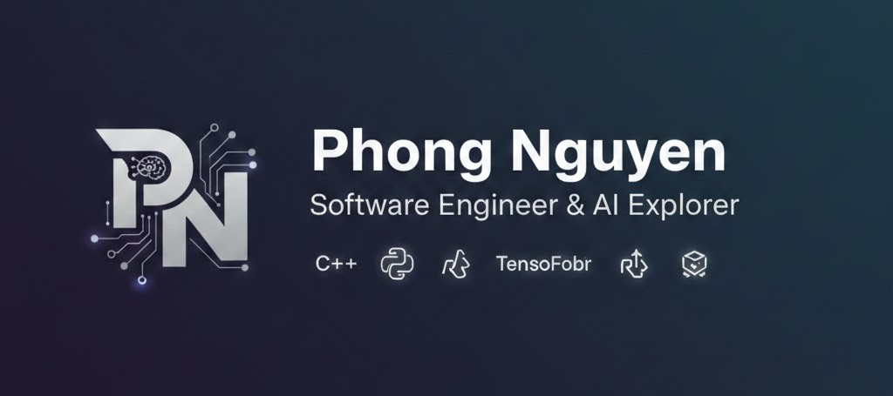

<!-- 
README.md for skyfalljoss (Phong Nguyen)
Enhanced version with better styling and structure.
Ensure you upload your header image (e.g., 'readme-header.png') to this repository first.
 -->

  <!-- Replace 'readme-header.png' with the filename of your uploaded image -->
  

<h1 align="center">Hi there, I'm Phong Nguyen 👋</h1>

  <strong>Software Engineer & Student</strong> 
  Building scalable web applications and exploring the depths of Machine Learning.

### 🚀 About Me

- 🔭 **Currently Focused On:** Developing robust full-stack applications using Next.js and enhancing AI models.
- 🌱 **Deepening My Skills In:** Backend architecture, machine learning integration, and creating intuitive user experiences.
- 💼 **Looking For:** Exciting **internship opportunities** where I can contribute and grow.
- 🤝 **Open To:** Collaborating on interesting Open Source projects.
- ⚡ **Fun Fact:** I enjoy optimizing code performance and experimenting with new frameworks!

### Projects
- CRM websites: https://crm-vibecode-git-main-phong-nguyens-projects-0775ccaa.vercel.app/
- Clone lovable: https://loveable-two.vercel.app/
- Portfolio: https://skyfalljoss.github.io/portfolio/ 
---

### 💻 My Tech Stack

| **Category** | **Technologies** |
| :--- | :--- |
| **Languages** | <code></code> C, <code></code> C++, <code></code> Python, <code></code> JavaScript, <code></code> TypeScript, <code></code> HTML5, <code></code> CSS3 |
| **Frontend** | <code></code> React, <code></code> Next.js, <code></code> TailwindCSS, <code></code> Bootstrap |
| **Backend** | <code></code> Node.js, <code></code> Django, <code></code> Flask |
| **AI / ML** | <code></code> TensorFlow, <code></code> Keras, <code></code> PyTorch, <code></code> spaCy |
| **Databases** | <code></code> PostgreSQL, <code></code> MySQL, <code></code> SQLite |
| **DevOps & Tools** | <code></code> Docker, <code></code> Git, <code></code> Postman, <code></code> Jira |

---

### 📫 Get In Touch

  
  
  

---

  <i>Thanks for stopping by! Feel free to explore my repositories.</i>

<!-- Optional: Visitor Counter (Uncomment if desired) -->
<!-- 

  

 -->
